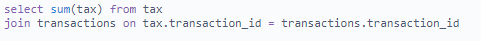
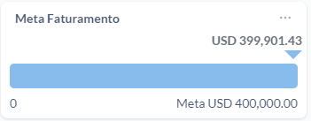
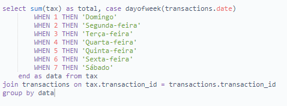
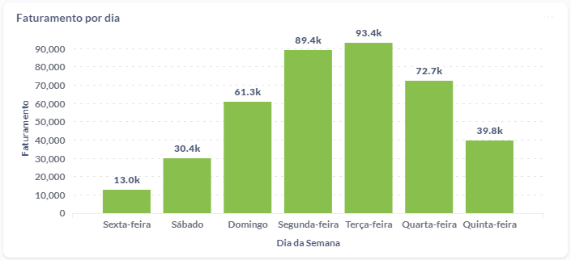
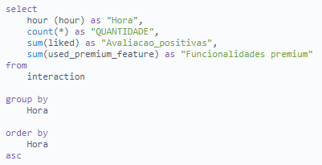
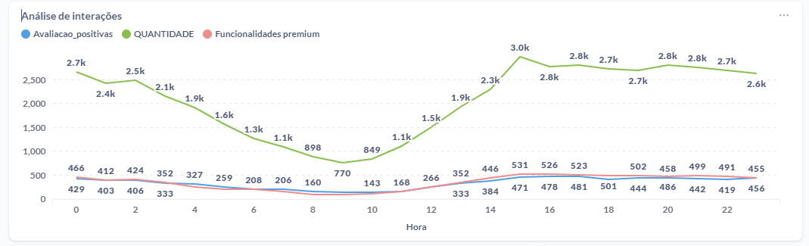
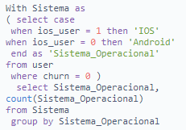
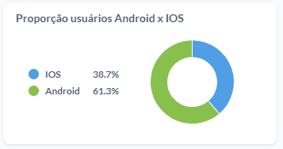
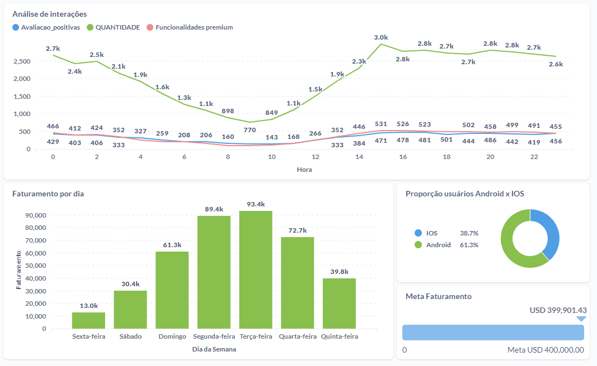

# Análise de comportamento de clientes utilizando o Metabase

> Neste case foi criado um dashboard com o intuito de analisar indicadores para definir o melhor momento para lançar um novo produto da empresa. Para isso, utilizou-se a linguagem SQL com o intuito de desenvolver um painel gerencial via Metabase

## Contexto

A "Bankverse" é uma *fintech* especializada em transferências bancárias que opera nos EUA. Ela será a responsável por lançar um serviço de transferência instantânea nos Estados Unidos da América (PS: eles não têm PIX por lá…). Mas para garantir o sucesso do lançamento, seu GPM gostaria de levantar algumas informações para definir a melhor data de lançamento dessa nova funcionalidade!

Ele quer atingir o maior número de usuários possível e para isso, gostaria de lançar o produto no dia e horário com maior engajamento. Além disso, gostaria de saber qual sistema operacional deve ser priorizado no desenvolvimento, para garantir que na data esteja disponível para o maior número de usuários possível.

Para construir o dashboard, utilizou-se da interação de 4 tabelas:

- Interaction
- Tax
- Transactions
- User

A base de dados contém informações entre 21 de abril de 2023 e 29 de abril de 2023, portanto, a análise comportamental se dará através desse período de dados.

Para cada tabela foi utilizado as seguintes colunas:

**TAX**

- **Transaction_id** → identificador único de transação;
- **Tax** → faturamento da empresa a cada transação;

**TRANSACTION**

- **Transaction_id** → identificador único de transação;
- **Date** → data da transação

**INTERACTION**

- **Hour** → horário da atividade
- **Used_premium_feature** → funcionalidades premium utilizadas
- **Liked** → avaliações positivas

**USER**

- **Ios_user** → Usuários de IOS `(0: não é; 1: é usuário)`;
- **Android_user** → Usuários de Android `(0: não é; 1: é usuário)`;
- **Churn** → Usuário que deixou a plataforma `(0: não deixou a plataforma; 1: deixou a plataforma**)**`

## Mão na massa!

A primeira visualização realizada foi uma verificação do cumprimento de meta, a meta da semana é de $400.000,00, dessa forma utilizou-se a Tabela Tax para obter este valor:

Através da query acima foi possível obter o primeiro visual do dashboard:

Para a segunda visualização foi analisado o faturamento da empresa por dia da semana, para isso utilizou-se a query:

Obtendo o seguinte visual através do Metabase:

Dando a sequência nas visualizações, foi realizada uma análise de interação por hora, contendo a quantidade de usuários ativos, avaliações positivas e funcionalidade premium:

Gerando o seguinte visual:

Por fim, com o intuito de entender melhor o sistema operacional utilizados pelos usuários, foi realizada a seguinte query:

Obtendo o visual:

Dessa maneira, pudemos obter um dashboard com a união de todos os visuais obtidos, a fim de facilitar a decisão:

## Conclusão

A partir dos visuais obtidos, juntamente com o dashboard, podemos gerar um overview para a gerência com o intuito de facilitar a tomada de decisão.

Podemos perceber que o melhor horário para lançar a nova funcionalidade seria as 15:00 no qual temos o pico de usuário ativos (~3 mil usuários), além disso, o melhor dia da semana em relação a faturamento se dá na Terça-feira e mais de 60% dos usuários utilizam o Sistema Operacional IOS, dessa maneira, é possível notar que o lançamento da nova funcionalidade teria um maior impacto ao ser lançada no início da semana (Segunda/Terça) e na parte da tarde (a partir das 14:00), ademais, caso seja necessário escolher um sistema operacional como piloto, faria mais sentido liberar a funcionalidade primeiro para os usuários de Iphone.